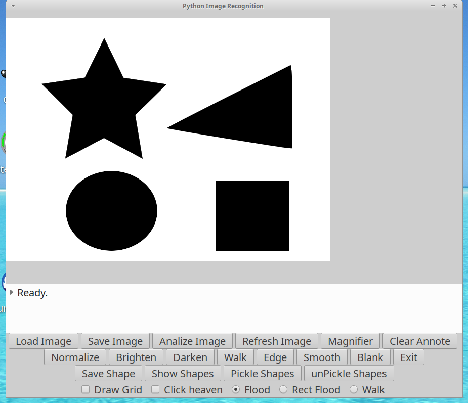
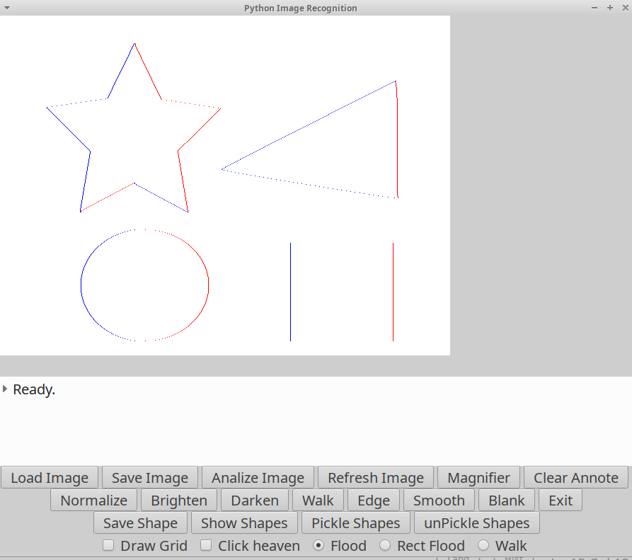

# PyImgRec

  Python image recognition. Drives the 'C' imgrec python extension.

  UNDER CONSTRUCTION

  Used to work on python 2 ... porting it.

GNU / Linux:

 Usual (autoconf) ./configure and make cycle works

## Screenshot:

## Edge detection:

### EOF
