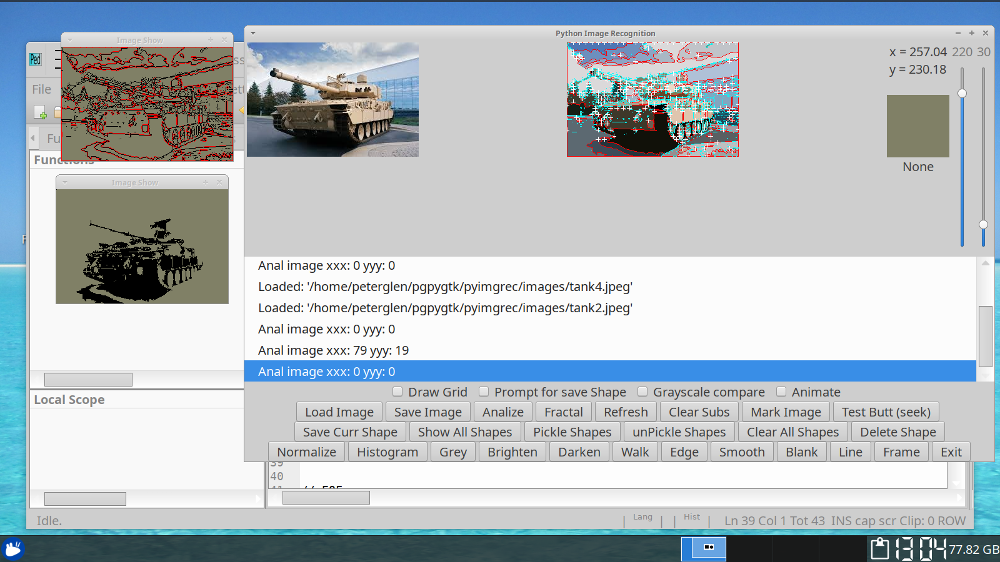

# PyImgRec

##  Python image recognition.

 The GUI Drives the 'C' imgrec python extension. Not all aspects are ported to 'C',
but they are easily doable.

  Used to work on python 2 ... ported it to python 3

GNU / Linux:

 Usual (autoconf) ./configure and make cycle works

## How it works:

  A flood fill algorithm is extended to emit coordinates of the flood fill terminal points.
This creates a 2 dimensional array that follows the object outline.

 This outline is then normalized by array size and magnitude, creating a uniform structure,
ideal for shape comparison.  (See: algorithm/norm_outline.py)

 This is all happening in ONE pass. Perfect algorithm for embedded solutions.

## Screenshot:

## Edge / Outline detection:

## Practical example

  The image below is a real world example. The outline is clearly recognizable
by the shape comparison algorithm.

## Another example

 No, this is not a suggestion, but a possibility. In a single pass we got the following:

// EOF
